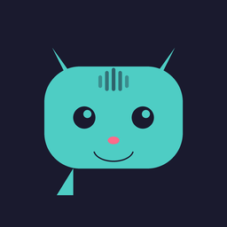
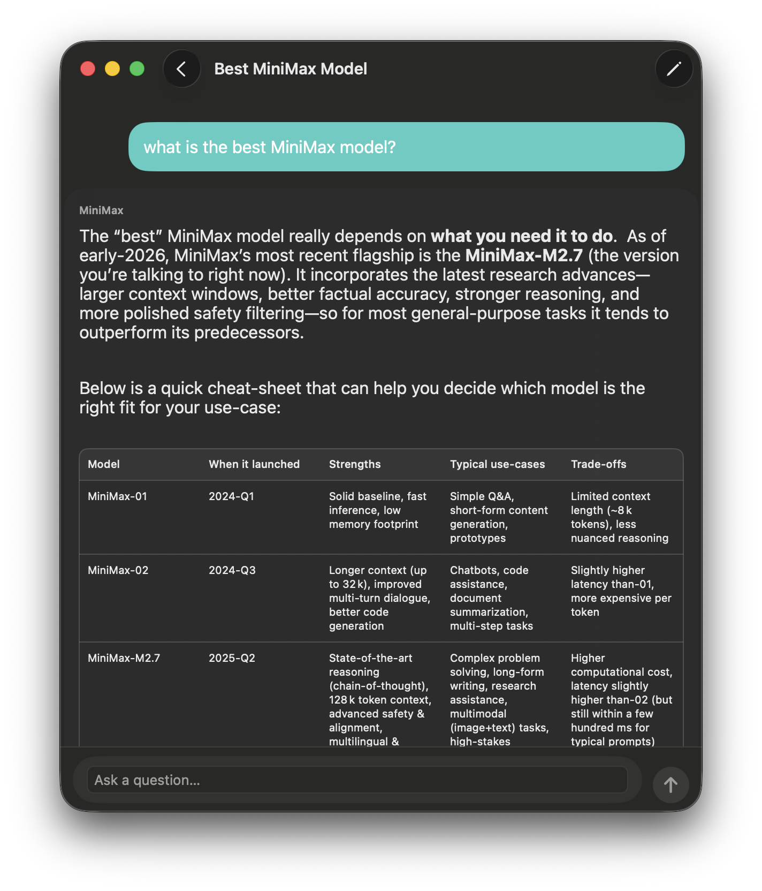
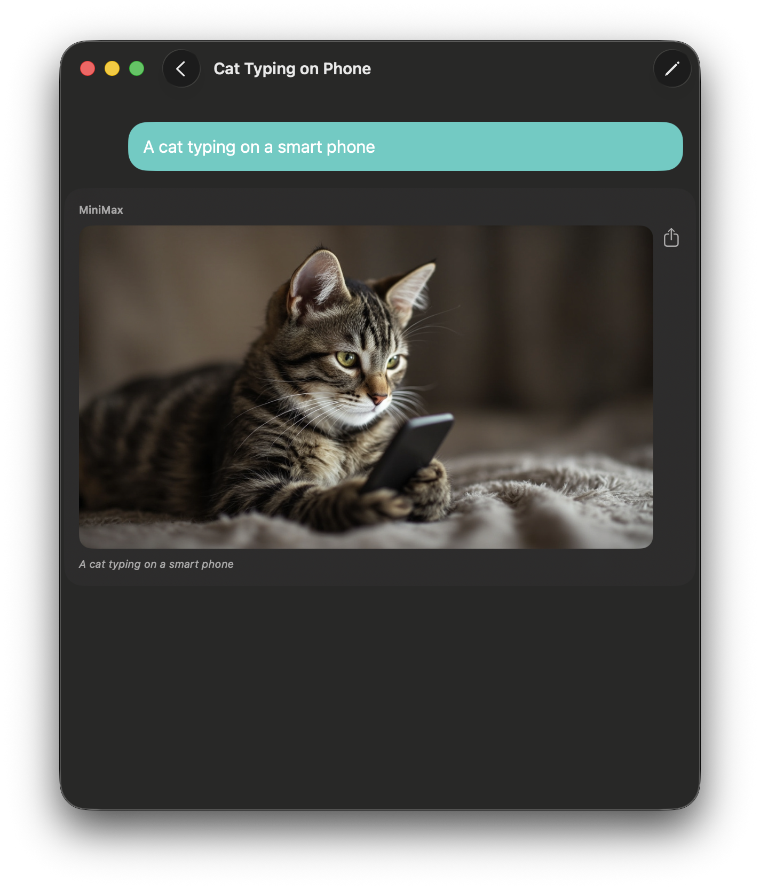
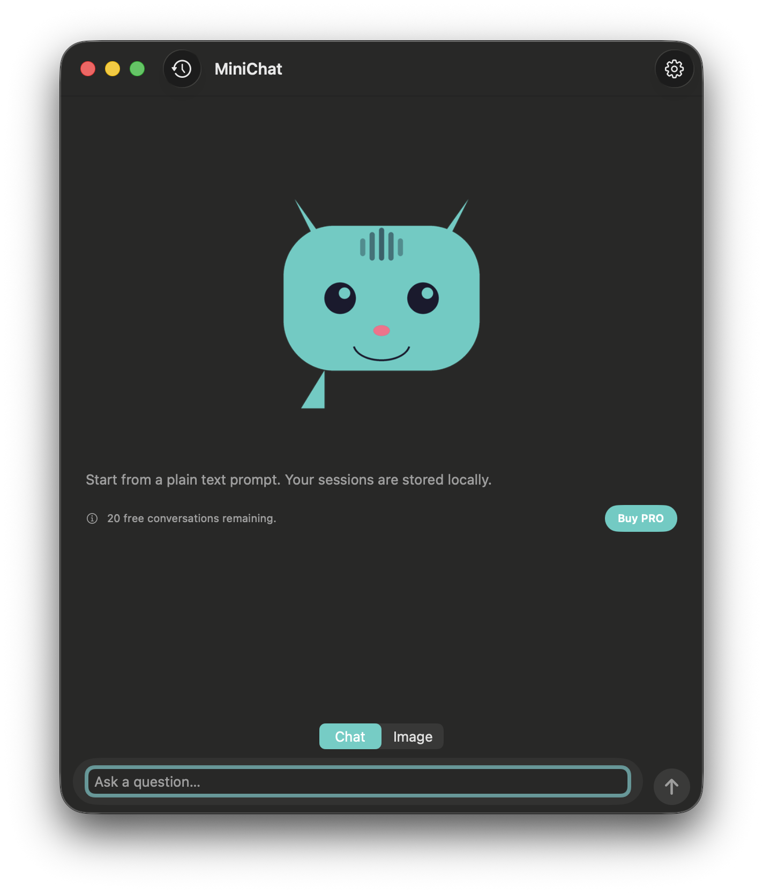
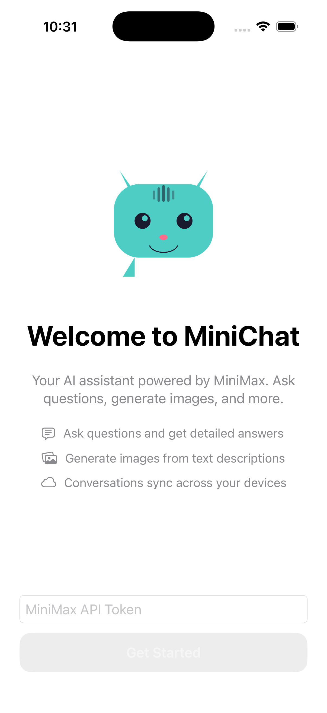
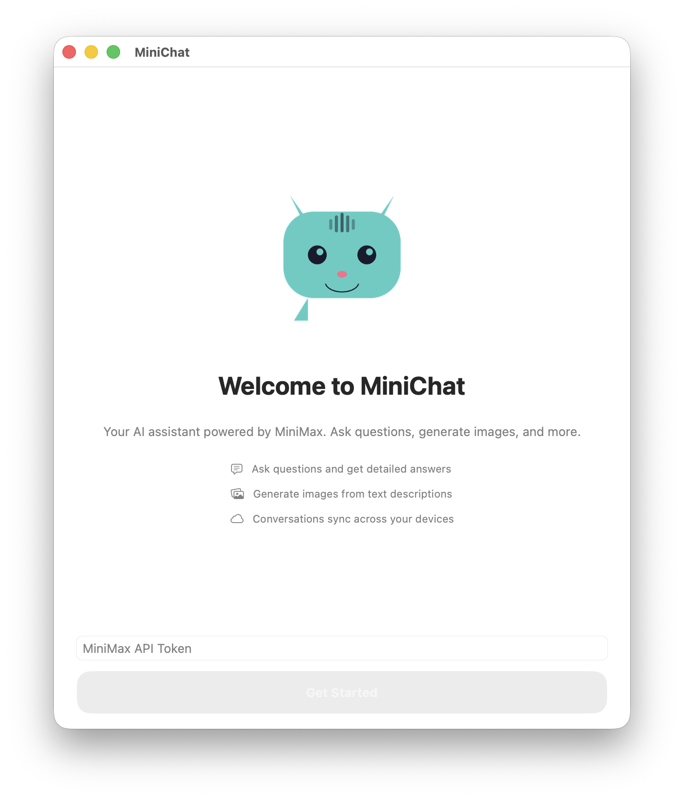

  

<h1 align="center">Maoai</h1>

  <strong>Your AI assistant powered by MiniMax</strong> 
  Ask questions, generate images, and more — on iPhone, iPad, and Mac.

  

---

## Features

### Ask Questions
Get detailed, well-formatted answers powered by MiniMax's advanced reasoning models. Responses include rich markdown formatting with bold text, headings, code blocks, and tables.

  
  &nbsp;&nbsp;&nbsp;
  

### Generate Images
Describe what you want and MiniMax creates it. Generate stunning AI images from text prompts with a single tap. Save or share images directly from the app.

  
  &nbsp;&nbsp;&nbsp;
  

### Native on Every Apple Device
Built with SwiftUI for a seamless experience on iPhone, iPad, and Mac. Maoai feels right at home on every platform with native controls, dark mode support, and platform-specific interactions.

  

### Conversation History
All your conversations are saved locally and can sync across your devices via iCloud. Search through past conversations with highlighted results.

### Easy Setup
Get started in seconds. Enter your MiniMax API token on the welcome screen and you're ready to go. Try the app in demo mode without an API key.

  
  &nbsp;&nbsp;&nbsp;
  

---

## Highlights

- **Advanced AI** — Powered by MiniMax-M2.7 with chain-of-thought reasoning
- **Image Generation** — Create AI images from text descriptions
- **Rich Formatting** — Markdown rendering with code blocks, tables, bold, and headings
- **Conversation History** — Search and browse past conversations
- **iCloud Sync** — Optionally sync conversations across all your devices
- **Dark Mode** — Beautiful dark interface on all platforms
- **Privacy First** — Your API token is stored securely in the Keychain
- **Free to Try** — 20 free conversations included, demo mode available

---

## Requirements

- iOS 17 or later / macOS 14 or later
- A MiniMax API token ([get one here](https://platform.minimax.io))

---

## Pricing

Maoai includes **20 free conversations**. After that, unlock unlimited access with a PRO subscription:

| Plan | Price |
|------|-------|
| Monthly | $0.99/month |
| Yearly | $4.99/year |

Usage is subject to the limits of your MiniMax plan.

---

## Privacy

Maoai does not collect any personal data. Your conversations stay on your device and your API token is stored securely in the Keychain. Read our full [Privacy Policy](PRIVACY.md).

---

  Made with care for the Apple ecosystem.

